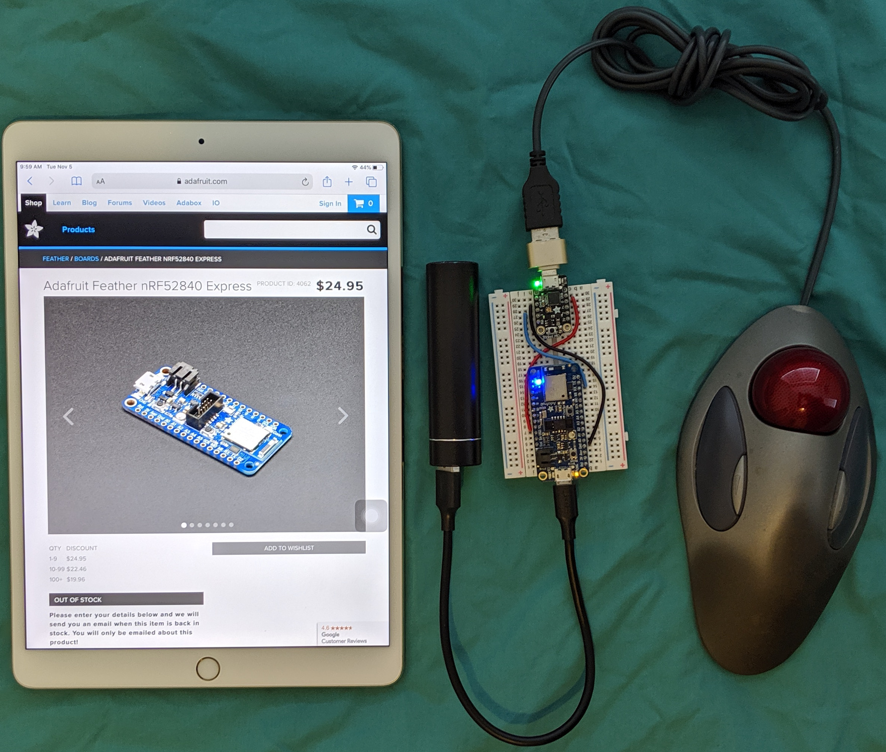

# Convert USB Mouse to Bluetooth LE

## Hardware

* Adafruit Trinket M0
* USB OTG to host cable or adapter
* Adafruit Feather nRF52840
* USB power bank, 5V out
* USB mouse

Trinket M0	|nRF52840
------------|--------
GND			|GND
USB			|USB
TX (4)		|RX

## Software

### Trinket M0

This programs to the Trinket M0 to act as a USB host for the mouse. USB
mouse HID reports are send out the UART TX (4) pin. The source code is
at [https://github.com/gdsports/usbhostcopro](https://github.com/gdsports/usbhostcopro).

### Feather nRF52840

USBMSEBLE receives HID reports via its UART TX and sends the reports out the
BLE mouse module.

## Firmware

The firmware directory has UF2 files for the Trinket M0 and the nRF52840 Express
so it is not necessary to build the firmware from source code.

Double click on the Trinket M0 reset button. When the TRINKETBOOT USB drive appears,
drag and drop the file MSEADVUARTUSBH.ino.trinket_m0.uf2 on the the drive.

Double click on the nRF52840 Express reset button. When the FTHR840BOOT USB
drive appears, drag and drop the file
USBMSEBLE.ino.feather_nrf52840_express.hex.uf2 on the the drive.
